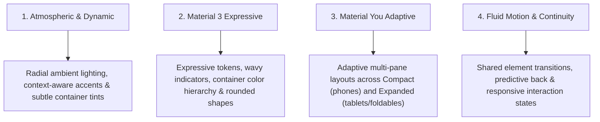

# Standard Android Design System & UI/UX Guidelines

Welcome to the **Standard Android Design System & UI/UX Specification**. This guide establishes modern design principles, color hierarchies, typography standards, component patterns, adaptive multi-pane rules, and motion guidelines for native Android applications built with **Jetpack Compose** and **Material 3 Expressive**.

**Any AI agent or engineer creating, reviewing, or refactoring Android UI should follow these guidelines to ensure consistency, high visual polish, and production readiness.**

---

## 1. Core Design Pillars



1. **Atmospheric & Dynamic Lighting**:
   - Modern interfaces leverage soft radial gradient lighting and subtle container tints to establish ambiance and depth without relying on heavy skeuomorphic drop shadows.
   - Dynamic accent colors tint backgrounds, badges, and outlines based on contextual domain metadata (e.g. category, theme, or feature identity).
2. **Material 3 Expressive Tokens**:
   - Standardize on official Material 3 Expressive components (`CircularWavyProgressIndicator`, `LinearWavyProgressIndicator`, `FilledTonalButton`).
   - Strictly adhere to M3 surface container roles (`surfaceContainerLowest`, `surfaceContainerLow`, `surfaceContainer`, `surfaceContainerHigh`, `surfaceContainerHighest`) to define elevation and visual hierarchy through color luminance.
3. **Material You Adaptive Multi-Pane Layouts**:
   - Design adaptive-first. Interfaces must scale seamlessly across screen sizes: single-column on compact phones, multi-column grids on foldables, and master-detail two-pane layouts on tablets and large screens.
4. **Fluid Motion & Visual Continuity**:
   - Employ shared element transitions to connect list items to detail views, maintaining spatial continuity across navigation destinations.
   - Respect user gestures: distinguish between programmatic automated scrolling and user-initiated drag gestures.

---

## 2. Color System & Surface Container Hierarchy

Material 3 replaces arbitrary drop shadows with semantic **Surface Container** color roles. Never use raw hex colors or arbitrary gray fills for card backgrounds; instead, use semantic tokens from `MaterialTheme.colorScheme`.

### Surface Container Tier Rules

| Role | Theme Token | Usage Guidance |
| :--- | :--- | :--- |
| **Base Canvas** | `MaterialTheme.colorScheme.surface` | Root background of the screen `Scaffold`. |
| **Lowest Container** | `MaterialTheme.colorScheme.surfaceContainerLowest` | Inset content panels, code/terminal editor surfaces, recessed wells. |
| **Low Container** | `MaterialTheme.colorScheme.surfaceContainerLow` | Standard cards, feed items, list tiles in default/unselected states. |
| **Default Container** | `MaterialTheme.colorScheme.surfaceContainer` | Top app bars, bottom navigation bars, floating bottom docks, modal sheets. |
| **High Container** | `MaterialTheme.colorScheme.surfaceContainerHigh` | Hero banners, highlighted cards, active/selected item states. |
| **Highest Container** | `MaterialTheme.colorScheme.surfaceContainerHighest` | Filter chips, tags, glyph badges, small interactive pill buttons. |

### Ambient Gradient Scrims

To introduce modern ambient lighting:
- **Root Screen Scaffolds**: Apply a subtle radial gradient at the top-center of the screen canvas (typically 10%–15% alpha of the primary or active category color) underneath the top app bar.
- **Card-Level Ambient Glow**: Because `Card` paints its `containerColor` on its internal surface, apply radial gradient scrims to the **inner container** (`Row` or `Column`) rather than the outer card modifier.
- **Subtle Outline Borders**: Complement surface containers with subtle borders instead of heavy elevation:
  ```kotlin
  Card(
      modifier = modifier.fillMaxWidth(),
      shape = MaterialTheme.shapes.large,
      colors = CardDefaults.cardColors(
          containerColor = MaterialTheme.colorScheme.surfaceContainerLow,
      ),
      border = BorderStroke(
          width = 1.dp,
          color = MaterialTheme.colorScheme.outlineVariant.copy(alpha = 0.35f),
      ),
  ) {
      Column(
          modifier = Modifier
              .fillMaxWidth()
              .padding(16.dp),
      ) {
          // Card content
      }
  }
  ```

---

## 3. Typography & Shapes

### Typography Guidelines
- **Screen & Section Titles**: `MaterialTheme.typography.titleLarge` or `headlineSmall` with `FontWeight.Bold` or `FontWeight.ExtraBold`.
- **Card Headlines**: `MaterialTheme.typography.titleMedium` with `FontWeight.SemiBold`.
- **Body Text**: `MaterialTheme.typography.bodyMedium` with `MaterialTheme.colorScheme.onSurface`.
- **Secondary & Caption Metadata**: `MaterialTheme.typography.bodySmall` or `labelSmall` with `MaterialTheme.colorScheme.onSurfaceVariant`.
- **Code / Monospace Tokens / Status Badges**: `FontFamily.Monospace` with `MaterialTheme.typography.labelSmall` and `FontWeight.Bold`.

### Shape Scale Guidelines
- **Hero Banners & Feature Cards**: `MaterialTheme.shapes.extraLarge` (28.dp) or `large` (16.dp).
- **Standard Cards & Modals**: `MaterialTheme.shapes.large` (16.dp) or `medium` (12.dp).
- **Badges, Pills & Chips**: `MaterialTheme.shapes.small` (8.dp) or `extraSmall` (4.dp).
- **Floating Action Buttons & Circular Avatars**: `CircleShape`.
- **Asymmetric Message / Chat Bubbles**:
  - Outgoing / User Bubble: `RoundedCornerShape(topStart = 18.dp, topEnd = 18.dp, bottomStart = 18.dp, bottomEnd = 4.dp)`
  - Incoming / System Bubble: `RoundedCornerShape(topStart = 18.dp, topEnd = 18.dp, bottomStart = 4.dp, bottomEnd = 18.dp)`

---

## 4. Material You Adaptive Multi-Pane Architecture

Never design exclusively for compact portrait phones. Modern Android apps must dynamically adapt across phone portrait, phone landscape, foldables, and tablets using AndroidX Window Size Classes:

```kotlin
@OptIn(ExperimentalMaterial3AdaptiveApi::class)
val windowAdaptiveInfo = currentWindowAdaptiveInfoV2()
val windowSizeClass = windowAdaptiveInfo.windowSizeClass

val isCompact = !windowSizeClass.isWidthAtLeastBreakpoint(WindowSizeClass.WIDTH_DP_MEDIUM_LOWER_BOUND)
val isMedium = windowSizeClass.isWidthAtLeastBreakpoint(WindowSizeClass.WIDTH_DP_MEDIUM_LOWER_BOUND) &&
    !windowSizeClass.isWidthAtLeastBreakpoint(WindowSizeClass.WIDTH_DP_EXPANDED_LOWER_BOUND)
val isExpanded = windowSizeClass.isWidthAtLeastBreakpoint(WindowSizeClass.WIDTH_DP_EXPANDED_LOWER_BOUND)
```

### Layout Breakpoints

| Breakpoint | Window Width | Recommended Layout Strategy |
| :--- | :--- | :--- |
| **Compact** | `< 600dp` (Phones) | Single vertical scrolling column. Secondary actions accessible via horizontal carousels or bottom sheets. |
| **Medium** | `600dp – 839dp` (Foldables, Small Tablets) | Two-column grid (`GridCells.Adaptive(minSize = 320.dp)`) or split header/content layout. |
| **Expanded** | `>= 840dp` (Tablets, Desktop/DeX) | Two-pane master-detail layout: Fixed left navigation/sidebar pane (340dp–380dp) + Expanded main content pane. |

---

## 5. Standard Component Patterns

### A. Top App Bar with Coordinated Nested Scroll
Always attach `pinnedScrollBehavior` or `enterAlwaysScrollBehavior` to both `TopAppBar` and the parent `Scaffold`:
```kotlin
val scrollBehavior = TopAppBarDefaults.pinnedScrollBehavior()

Scaffold(
    modifier = modifier.nestedScroll(scrollBehavior.nestedScrollConnection),
    topBar = {
        TopAppBar(
            title = {
                Text(
                    text = "Screen Title",
                    style = MaterialTheme.typography.titleLarge,
                    fontWeight = FontWeight.Bold,
                )
            },
            scrollBehavior = scrollBehavior,
        )
    },
) { innerPadding ->
    // Apply innerPadding to the root scrolling container
    LazyColumn(
        modifier = Modifier.fillMaxSize(),
        contentPadding = innerPadding,
    ) {
        // Items
    }
}
```

### B. Progress Indicators: Animated Wavy vs. Static Gauge
- **Indeterminate Operations (Loading, Connecting)**: Use `CircularWavyProgressIndicator()`.
- **Streaming & In-Flight Active Work (Downloads, Generation)**: Use `LinearWavyProgressIndicator(progress = { progressFloat })` for fluid, organic motion during active background processes.
- **Static Completion Gauges (Course/Task Completion, Quotas)**: Use standard `LinearProgressIndicator(progress = { progressFloat })` without wavy oscillation to avoid visual fatigue when displaying settled statistics.

### C. Expressive Empty States
Every screen or container that displays a list or dynamic content MUST provide a dedicated, expressive empty state:
```kotlin
@Composable
fun ExpressiveEmptyState(
    icon: ImageVector,
    title: String,
    description: String,
    actionLabel: String? = null,
    onAction: (() -> Unit)? = null,
    modifier: Modifier = Modifier,
) {
    Column(
        modifier = modifier
            .fillMaxWidth()
            .padding(32.dp),
        horizontalAlignment = Alignment.CenterVertically,
        verticalArrangement = Arrangement.spacedBy(12.dp),
    ) {
        Surface(
            shape = CircleShape,
            color = MaterialTheme.colorScheme.surfaceContainerHighest,
            modifier = Modifier.size(72.dp),
        ) {
            Box(contentAlignment = Alignment.Center) {
                Icon(
                    imageVector = icon,
                    contentDescription = null,
                    tint = MaterialTheme.colorScheme.primary,
                    modifier = Modifier.size(32.dp),
                )
            }
        }
        Text(
            text = title,
            style = MaterialTheme.typography.titleMedium,
            fontWeight = FontWeight.Bold,
            color = MaterialTheme.colorScheme.onSurface,
            textAlign = TextAlign.Center,
        )
        Text(
            text = description,
            style = MaterialTheme.typography.bodyMedium,
            color = MaterialTheme.colorScheme.onSurfaceVariant,
            textAlign = TextAlign.Center,
        )
        if (actionLabel != null && onAction != null) {
            FilledTonalButton(onClick = onAction) {
                Text(actionLabel)
            }
        }
    }
}
```

### D. Interactive List Auto-Scroll vs. User Drag Gestures
When building streaming, live-updating, or real-time message feeds:
1. **Detect Physical User Interaction**: Use `listState.interactionSource.collectIsDraggedAsState()` to detect physical touch/scroll actions.
2. **Freeze Viewport on Interruption**: If the user scrolls up to review history while items are streaming, freeze auto-scrolling immediately.
3. **Floating Return Affordance**: Display an animated "Jump to Bottom ↓" pill when scrolled away from the bottom.
4. **Resume Scrolling**: Automatically resume following new items once the user scrolls back to bottom or taps the jump button.

---

## 6. Shared Element Transitions & Navigation Motion

Visual continuity transforms navigation from jarring view-swaps into a cohesive spatial experience.

### Shared Element Guidelines
1. **Container Morphs**: Use `Modifier.sharedBounds()` on cards, dialog surfaces, and hero containers to morph bounds smoothly between screen transitions.
2. **Discrete Badges & Glyphs**: Use `Modifier.sharedElement()` for discrete icons, avatars, and text labels that translate and resize across screens.
3. **Defensive Availability Check**: Always verify that the shared transition scope is active before invoking shared element modifiers. Provide clean fallbacks if navigating without a shared scope (e.g. deep links, preview environments).
4. **Collision-Proof Key Scoping**:
   - Unique single-instance elements: use singleton `data object` keys (e.g., `HeaderAvatarKey`).
   - Dynamic items in lists: use `data class` keys parameterized by unique item IDs (e.g., `ItemCardKey(itemId = item.id)`) to prevent Compose animation collisions.

---

## 7. Mandatory Compose Previews

Every composable screen, component, or modular state variant MUST include comprehensive Compose Previews to enable rapid verification across themes and form factors.

### Preview Requirements
1. **Light & Dark Theme Coverage**: Use `@PreviewLightDark` or custom `@ThemePreviews` multi-preview annotations.
2. **Explicit Theme Surface Wrapping**: Always wrap preview content in your application theme with dynamic color disabled and an enclosing `Surface`:
   ```kotlin
   @ThemePreviews
   @Composable
   private fun MyComponentPreview() {
       MyAppTheme(dynamicColor = false) {
           Surface {
               MyComponent(
                   state = MyComponentState.Sample,
                   modifier = Modifier.padding(16.dp),
               )
           }
       }
   }
   ```
3. **Multiple Visual States**: Provide previews for:
   - **Nominal / Default**: Standard content with realistic text lengths.
   - **Loading / In-Flight**: Shimmer, progress indicators, or active background work.
   - **Error / Empty**: Feedback alerts, error containers, or empty state illustrations.
4. **Device Multi-Previews**: For full-screen layouts, annotate with `@DevicePreviews` (covering Compact Phone, Foldable unfolded, and 10-inch Tablet) to verify adaptive breakpoints directly in the IDE previewer.

---

## 8. AI Agent Implementation Checklist

Before completing any UI/UX task or submitting a pull request, verify each item on this checklist:

- [ ] **M3 Container Tier Compliance**: Are cards using `surfaceContainerLow` and top/bottom bars using `surfaceContainer`?
- [ ] **Elevation & Borders**: Are cards styled with subtle `BorderStroke(1.dp, outlineVariant.copy(alpha = 0.35f))` instead of heavy drop shadows?
- [ ] **Adaptive Responsiveness**: Is the layout verified across Compact (<600dp) and Medium/Expanded (>=600dp) window sizes?
- [ ] **Progress Indicators**: Are indeterminate/streaming operations using wavy indicators and settled metrics using static indicators?
- [ ] **Empty & Error States**: Are zero-data states and error scenarios handled with expressive visual feedback rather than blank screens?
- [ ] **Compose Previews**: Are light/dark theme previews and realistic sample data provided for all new or modified composables?
- [ ] **Code Formatting & Linting**: Did you execute your project's formatting (`formatKotlin` / `ktlint`) and static analysis (`check` / `lint`) tasks?
